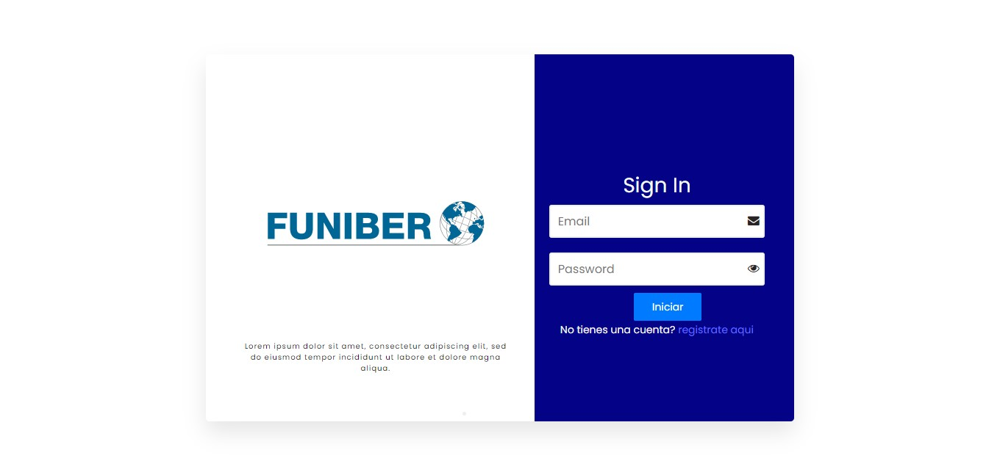
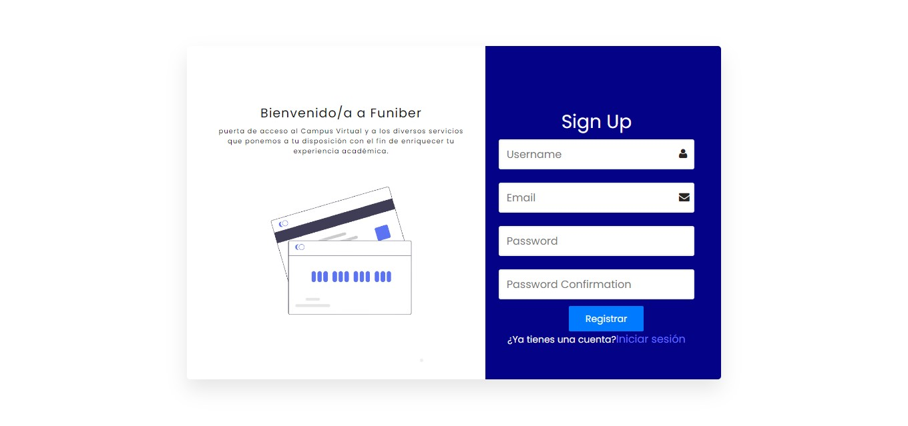
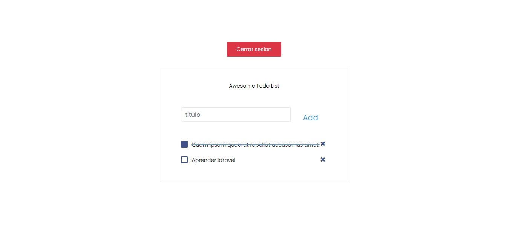

# laravel-react-todo
A simple todo app written in php using [Laravel](https://laravel.com) and [ReactJS](https://reactjs.org).

# Getting Started
Clone the project by running the command below:

`git clone https://github.com/DevLop-EC/ct-candidates-app.git`

then run:

`composer install`

rename `.env.example` to `.env`
then run:

`php artisan key:generate`

then fill your database details in your .env file

now you can run migrations:

`php artisan migrate --seed`

then start the application:

`php artisan serve`

and visit http://localhost:8000 to see the application.

## Frontend
The frontend is built using ReactJS and is located in separate folder called `react-client` in the root directory of the project.

## Built With
* [Vite](https://vitejs.dev/) - The web framework used

To start the frontend, run the command below:

`npm install`

then run:

`npm run dev`

and visit http://localhost:3000 to see the application.

create a .env file in the root directory of the project and add the following:

`VITE_API_URL=http://localhost:8000/api`

# Built with
* [Laravel](https://laravel.com)
* [ReactJS](https://reactjs.org)
* [Bootstrap](https://getbootstrap.com)
* [Font Awesome](https://fontawesome.com)
* [Redux](https://redux.js.org)
* [React Router](https://reacttraining.com/react-router/web/guides/quick-start)
* [Redux Toolkit](https://redux-toolkit.js.org)
* [MySQL](https://www.mysql.com)
* [Context API](https://reactjs.org/docs/context.html)
 
# Thanks to
I would like to thank [Funiber](
https://www.funiber.org) for giving me the opportunity to participate in this challenge.

# Author
* **Christian Lopez Aguirre**

# Screenshots
## Login Page

## Register Page

## Todo Page
